# Restaurant Review Scoring with AutoGen

## Project Overview

This project uses Python, AutoGen, and the OpenAI API to analyze natural-language restaurant reviews with a sequential multi-agent workflow. Given a question about a restaurant, the workflow retrieves its reviews, converts food and customer-service descriptions into numeric scores, and calculates an overall restaurant score on a 0–10 scale.

## Features

- Identifies the restaurant name from a natural-language user query.
- Retrieves matching reviews from `restaurant-data.txt`.
- Analyzes the food and customer-service descriptions in every review.
- Maps a fixed set of descriptive keywords to scores from 1 to 5.
- Calculates an overall score on a 0–10 scale.
- Returns the final score with three decimal places.
- Handles capitalization and punctuation differences in restaurant names, such as `In N Out` and `In-n-Out`.
- Uses multiple AutoGen agents in a sequential workflow with summary carryover.

## Multi-Agent Workflow

The workflow is coordinated by `entrypoint_agent` through AutoGen's sequential chat API:

- `entrypoint_agent` supervises the workflow, starts each chat, carries results between stages, and executes registered Python functions.
- `data_fetch_agent` identifies the restaurant and requests `fetch_restaurant_data`.
- `review_analysis_agent` converts the mapped food and service adjectives in each review into score arrays.
- `scoring_agent` requests `calculate_overall_score` with the complete score arrays and formats the final result.

```mermaid
flowchart LR
    A[User Query] --> B["main(user_query)"]
    B --> C["entrypoint_agent<br/>Orchestrates sequential chats"]
    C --> D["data_fetch_agent<br/>Identifies the restaurant"]
    D --> E["entrypoint_agent executes<br/>fetch_restaurant_data"]
    E --> F["review_analysis_agent<br/>Extracts food and service scores"]
    F --> G["scoring_agent<br/>Requests the final calculation"]
    G --> H["entrypoint_agent executes<br/>calculate_overall_score"]
    H --> I["Final result<br/>Printed and returned"]
```



## Scoring Rules

Each review is scored only from the fixed keywords below:

| Score | Keywords                          |
| ----: | --------------------------------- |
|     1 | awful, horrible, disgusting       |
|     2 | bad, unpleasant, offensive        |
|     3 | average, uninspiring, forgettable |
|     4 | good, enjoyable, satisfying       |
|     5 | awesome, incredible, amazing      |

For every review, the analysis produces:

- `food_score`
- `customer_service_score`

For $N$ reviews, let $f_i$ be the food score and $s_i$ be the
customer-service score of review $i$. The overall score is:

```math
\mathrm{OverallScore}
=
\frac{10}{N\sqrt{125}}
\sum_{i=1}^{N}
\sqrt{f_i^{2}s_i}
```

where $N$ is the total number of reviews.

`calculate_overall_score` rounds the result to three decimal places.

## Project Structure

```text
lab01-violet/
├── main.py                 # Multi-agent workflow and scoring functions
├── test.py                 # Public test suite
├── restaurant-data.txt     # Restaurant review dataset
├── requirements.txt        # Python dependencies
├── student_info.json       # Student submission metadata
├── Instructions.md         # Lab specification
└── README.md               # Project documentation
```

## Installation

1. Clone the repository:

   ```bash
   git clone https://github.com/violet58-lab/lab01-violet.git
   cd lab01-violet
   ```

2. Create and activate a virtual environment.

   Windows PowerShell:

   ```powershell
   python -m venv .venv
   .venv\Scripts\Activate.ps1
   ```

   macOS/Linux:

   ```bash
   python3 -m venv .venv
   source .venv/bin/activate
   ```

3. Install the dependencies:

   ```bash
   pip install -r requirements.txt
   ```

## API Key Setup

The program requires an OpenAI API key in the `OPENAI_API_KEY` environment variable.

Windows PowerShell:

```powershell
$env:OPENAI_API_KEY="your-api-key"
```

Windows Command Prompt:

```cmd
set OPENAI_API_KEY=your-api-key
```

macOS/Linux:

```bash
export OPENAI_API_KEY="your-api-key"
```

Never place a real API key in the source code or upload one to GitHub. Use `your-api-key` only as a placeholder in documentation.

## Usage

Pass one restaurant question as the command-line argument:

```bash
python main.py "What is the overall score for In N Out?"
```

Another example:

```bash
python main.py "How good is the restaurant Chick-fil-A overall?"
```

## Testing

Run the public test suite with:

```bash
python test.py
```

The public tests query the following restaurants:

- Taco Bell
- In-n-Out
- Chick-fil-A
- Krispy Kreme

Run the public test suite to verify the implementation.

## Technologies

- Python
- AutoGen
- OpenAI API
- Multi-Agent Systems
- Natural Language Processing
- Function Calling

## Notes

- A valid OpenAI API key is required to run the workflow.
- The final score is displayed with at least three decimal places.
- Restaurant names in user queries may differ from the dataset in capitalization or punctuation.
- The project is designed to process only restaurants present in `restaurant-data.txt`.

## Acknowledgements

This project was developed as an LLM Agents Lab exercise in using multi-agent systems to process unstructured natural-language data.
